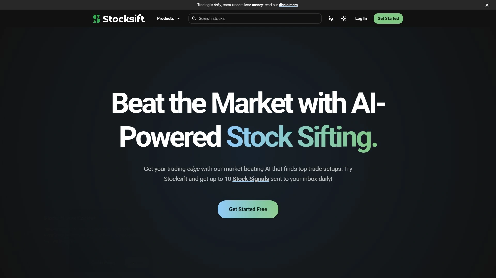
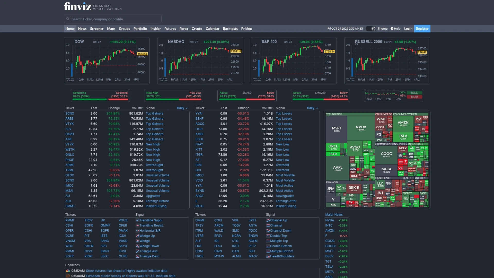
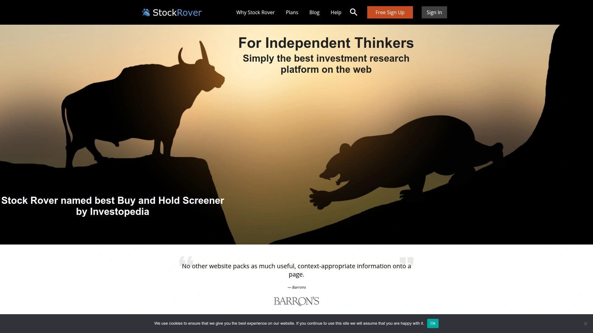
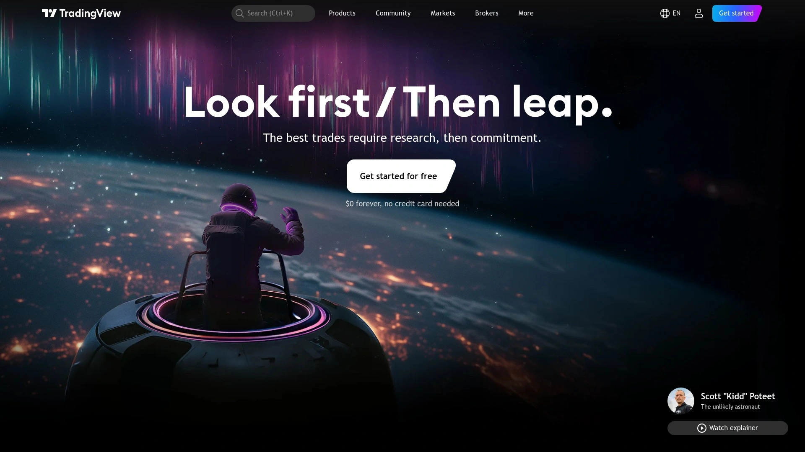
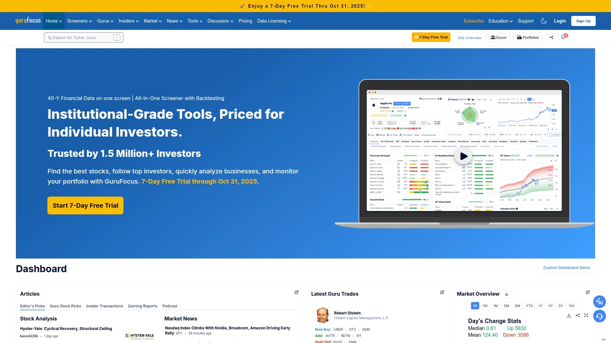
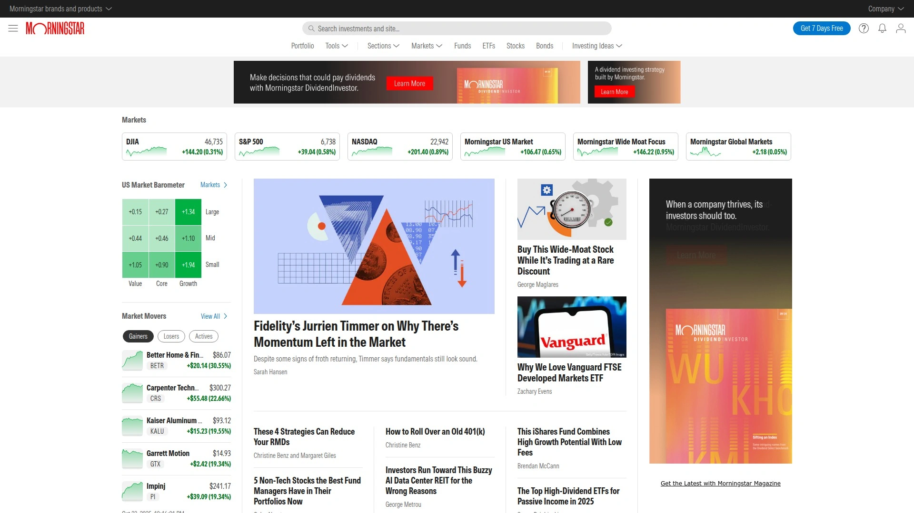
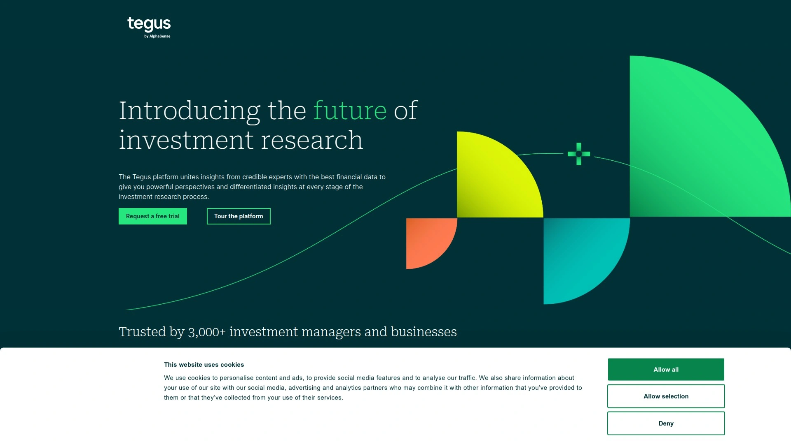
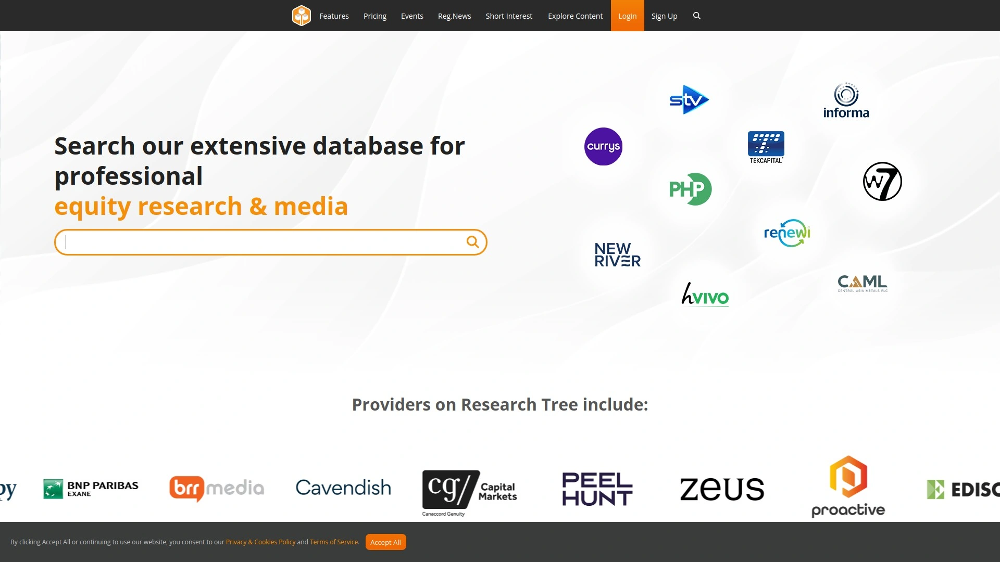

# Latest Stock Screening Platform Overview (Including AI-Powered Tools)

Scrolling through thousands of stock tickers manually while opportunities disappear, paying for multiple research subscriptions that barely coordinate, missing profitable setups because your screening tools don't update fast enough—traditional stock research eats hours daily that modern traders simply don't have. AI-powered screening platforms now consolidate technical analysis, fundamental research, and sentiment tracking into single interfaces that generate actionable insights in seconds rather than hours. Individual traders report cutting research time by 75% while catching profitable setups they previously missed entirely through manual analysis.

## **[StockSift](https://stocksift.com)**

AI-powered stock screening designed for retail traders.

Launched officially in 2025, StockSift specializes in simplifying stock trading through intuitive, AI-enhanced tools built specifically for individual traders. The platform analyzes over 9,500 stocks using 2,000+ filters, delivering insights through plain English prompts rather than requiring complex technical knowledge. This approach makes sophisticated analysis accessible regardless of experience level.

AI Stock Ratings generate on-demand insights by simplifying technical, fundamental, risk, and sentiment analysis into easy-to-understand 0-10 scores per stock. The system provides faster, unbiased, and consistent ratings compared to human-driven opinions, adapting to market changes and delivering insights within seconds. Users generate unlimited ratings without restrictions. The platform emphasizes these are analytical tools, not buy/sell recommendations—consulting financial professionals remains essential.

The AI-powered screener accepts natural language queries to create custom filters matching specific trading strategies. Instead of learning complex screening syntax, you describe what you're looking for in plain English and the AI translates that into actionable stock lists. AI-driven trade setups identify opportunities automatically, sending email alerts when StockSift AI discovers matching conditions.

AI predictions help identify potential movers, trending stocks, and hot opportunities before they gain widespread attention. The candlestick pattern analyzer evaluates 360+ patterns with expected value and win rate statistics, quickly surfacing top trade setups. All features emphasize simplicity—powerful tools that don't require steep learning curves or coding knowledge.

Free accounts provide access to basic features, while elite plans unlock full AI capabilities including unlimited stock ratings and advanced screening. The platform prioritizes keeping tools simple and effective, believing retail traders deserve professional-grade analysis without professional-grade complexity. For traders wanting AI assistance without overwhelming technical requirements, StockSift delivers sophisticated analysis through accessible interfaces.

## **[Finviz](https://finviz.com)**

Comprehensive free screener with visual market insights.

Short for "financial visualizations," Finviz delivers one of the most feature-rich stock screeners available to retail investors. The platform combines fundamental and technical data with visual tools like heatmaps that show sector performance at a glance. This visualization helps traders quickly gauge market conditions and identify opportunities.

The free version provides delayed quotes and essential screening tools across descriptive, fundamental, and technical filter categories. Descriptive filters cover market cap, sector, price, and volume. Fundamental filters highlight P/E ratios, earnings growth, and debt levels. Technical filters include price trends, moving averages, and chart patterns. Users combine multiple filter types simultaneously for precise results.

Elite membership at $24.96 monthly (billed annually) unlocks real-time data, intraday charts, custom alerts, and data export capabilities. The real-time updates prove crucial for day traders needing immediate information. Custom alerts trigger on price movements, volume changes, or technical patterns, saving monitoring time. The interface feels crowded initially but becomes efficient once familiar.

Preset screeners accelerate common searches—users save custom filter combinations for quick access to repeated queries. The platform tracks unusual trading volume, analyst ratings, and insider activity automatically. Integration with GPT allows automated screener link generation based on strategy descriptions, transforming basic filtering into strategic radar for opportunities. For traders prioritizing visual market analysis and comprehensive filtering at minimal cost, Finviz delivers exceptional value.

## **[Stock Rover](https://www.stockrover.com)**

Fundamental analysis powerhouse for buy-and-hold investors.

Since 2008, Stock Rover has simplified stock research and portfolio management for long-term investors needing extensive fundamental screening. The platform scores securities from 1 to 100 across categories like sentiment, valuation, credit strength, and dividends, making quality assessment straightforward. Warren Buffett fans appreciate preset fair market value and margin of safety screeners.

The screening capabilities filter 8,500+ North American stocks based on 275+ financial metrics on entry-level plans, scaling to 700+ metrics on premium subscriptions. Five years of historical data support trend analysis on basic tiers, extending to ten years on higher plans. The massive fundamental database includes complete company financial statements spanning years.

Comparison tools evaluate competing investment options side-by-side, computing fair values and warning about trends deserving attention. Research reports consolidate everything relevant about stocks into well-structured, comprehensive documents accessible with one click. Portfolio tracking links with brokerage accounts for automatic updates showing performance metrics accurate to the minute.

Charting extends beyond industry standards, letting you compare screeners, portfolios, and benchmarks while charting fundamental metrics directly. The web 2.0 interface uses desktop software conventions like right-click menus and resizable panels, making powerful functionality quick to learn. Mobile optimization works seamlessly across desktops, laptops, tablets, and phones.

The free plan provides solid starting capabilities, with paid tiers ranging from $7.99 to $27.99 monthly offering progressively more metrics, data history, and features. For buy-and-hold investors prioritizing fundamental analysis and long-term value assessment, Stock Rover delivers unmatched depth.

## **[TradingView](https://www.tradingview.com)**

Social charting platform serving 100+ million traders.

TradingView combines powerful technical analysis with clean, intuitive design that's fast and easy to use. The platform covers 3.5 million instruments across 150+ exchanges, including stocks, ETFs, futures, forex, and cryptocurrency. This breadth makes it suitable for traders working across multiple asset classes.

The charting engine stands out as exceptionally fast, reliable, and customizable. Bar Replay allows rewinding charts to any historical point and replaying markets as if they were happening live, enabling practice trades through historical data at accelerated speeds. This feature dramatically improves trading skills by letting users run through thousands of practice scenarios quickly.

Six main screeners cover stocks, forex, crypto pairs, crypto coins, and ETFs with filtering by quantitative data points and indicators. Heatmaps provide quick market pulse checks, showing sector performance and biggest movers at a glance. The Technical Rating system calculates averages of 13 indicators, offering directional bias measurements.

Social features let traders share ideas, publish analysis, and follow successful traders within the platform community. Custom indicators and strategies can be coded using Pine Script programming language. The free plan includes ads and limits features like multiple chart layouts and indicator slots.

Paid plans start at $16.95 monthly for Essential, scaling to $33.95 for Plus with expanded capabilities. The 30-day free trial lets you test premium features before committing. For day and swing traders prioritizing chart analysis and social trading insights, TradingView delivers industry-leading capabilities.

## **[GuruFocus](https://www.gurufocus.com)**

Value investing platform following legendary investors.

GuruFocus targets institutional and individual value investors seeking high-potential stocks already researched by world-class investors. The "Guru Portfolios" feature tracks holdings and strategies of prominent hedge fund managers like Warren Buffett and Charlie Munger, providing insight into legendary investor thinking. This approach helps inform decision-making through proven expertise.

Advanced stock screeners filter based on valuation ratios, financial metrics, and investment parameters aligned with value investing principles. Valuation tools include discounted cash flow calculators and Graham Number calculators that assess whether stocks are fairly valued or overpriced. These models support disciplined buy and sell decisions.

Warning signs automatically flag potential red flags in company financial health, such as deteriorating margins or excessive debt. The platform provides stock financials, valuation data, and proprietary backtesting tools enabling data-driven investment decisions. Users identify opportunities matching their strategies through comprehensive filtering.

The emphasis on following guru portfolios distinguishes GuruFocus from general screeners—rather than starting from scratch, you analyze what successful investors already own and understand their reasoning. For value investors wanting to learn from and follow proven investment strategies, GuruFocus delivers unique insights.

## **[Morningstar](https://www.morningstar.com)**

Institutional-grade research with star rating system.

Morningstar provides investment research covering mutual funds, ETFs, and stocks with their proprietary rating system and extensive data. The platform serves both individual investors and financial professionals needing credible, independent analysis. Star ratings from 1 to 5 summarize analyst opinions on investment quality at a glance.

Research reports deliver comprehensive fundamental analysis written by professional analysts covering companies across industries. Portfolio management tools track holdings, analyze asset allocation, and provide rebalancing recommendations. The platform emphasizes long-term investing and quality assessment over short-term trading.

Mutual fund and ETF screeners help investors identify funds matching specific criteria including expense ratios, performance history, and management quality. The extensive database includes thousands of funds with detailed breakdowns of holdings, strategies, and risk profiles. This depth supports thorough due diligence.

Subscription tiers range from basic free access through premium professional services depending on research depth required. The institutional focus means the platform prioritizes thoroughness over speed—ideal for patient, long-term investors rather than active traders. For investors wanting professional-grade research backing buy-and-hold strategies, Morningstar delivers credible analysis.

## **[Tegus](https://www.tegus.com)**

Expert network insights with financial modeling.

Tegus unites insights from credible experts with comprehensive financial data, providing powerful perspectives at every stage of investment research. The platform's expert network database features thousands of calls across various sectors, perfect for in-depth industry analysis. This qualitative research complements quantitative screening.

Financial models are fully drivable and updated by professional analysts, providing accurate company and industry-specific KPIs alongside comprehensive data. Users download models, access filings and earnings calls, dig into expert insights, and procure custom expert calls all within one platform. This consolidation eliminates juggling multiple research tools.

SEC filings, news, events, and presentations are streamlined into easy-to-digest formats with automated analysis highlighting key points. The mobile app enables research on the go without sacrificing functionality. AI-powered views synthesize the massive curation of expert perspectives alongside custom-sourced calls.

The premium pricing reflects institutional targeting—Tegus serves professional investors, hedge funds, and research firms needing deep industry expertise. For organizations prioritizing expert insights and sophisticated financial modeling, Tegus delivers unmatched research depth.

## **[Research Tree](https://www.research-tree.com)**

Democratized access to professional equity research.

Research Tree aggregates professional research reports from various analysts into one searchable platform, providing valuable insights for informed investment decisions. Over 65,000 investors use the platform to access 2 million+ downloaded equity research notes from 150+ providers. This democratization makes institutional-quality research accessible to individual investors.

Personalized watchlists let you track favorite equities and receive updates on their performance from a centralized dashboard. Custom email alerts deliver timely notifications about significant market movements and new research publications. The breadth of providers creating sector and thematic notes uncovers unique investment opportunities.

Research feeds increase accessibility and visibility of professional equity research, making it easier for investors to discover quality analysis. Provider portals present equity research in organized, compliant destinations for investors. The platform serves both individual investors seeking insights and research providers wanting distribution.

For investors wanting institutional-quality equity research without paying premium analyst subscription fees, Research Tree consolidates diverse perspectives into accessible formats.

## How do AI stock screeners differ from traditional filters?

Traditional screeners require manually selecting criteria like P/E ratios, market cap ranges, and technical indicators through dropdown menus and sliders. AI-powered platforms like StockSift accept natural language descriptions—"show me undervalued tech stocks with strong momentum"—and automatically translate those into appropriate filters. This eliminates learning complex screening syntax and makes sophisticated strategies accessible to beginners. AI also adapts to changing market conditions faster than static rules, providing recommendations that evolve with current trends.

## Can free stock screeners match paid platforms?

Free tools like Finviz and Stock Rover's basic tier provide substantial capabilities sufficient for most individual investors. The main limitations involve delayed data (15-20 minutes behind real-time), reduced filter options, and restricted access to advanced features like custom alerts and data exports. Day traders needing real-time information benefit significantly from paid subscriptions, while long-term investors focusing on fundamental analysis often succeed with free versions. Test free tiers first—many users discover they don't need premium features for their strategies.

## What's the learning curve for stock screening platforms?

Basic screening functionality becomes comfortable within hours of experimentation—most platforms use intuitive filter interfaces accessible to beginners. Advanced features like custom formulas, backtesting, and complex multi-condition screens require days or weeks to master depending on platform complexity. Platforms emphasizing simplicity like StockSift reduce learning curves by using plain English inputs instead of technical syntax. TradingView's Bar Replay feature accelerates learning by letting you practice strategies on historical data at accelerated speeds. Start with preset screeners matching your strategy, then gradually customize as you understand underlying logic.

## Conclusion

Stock research transformed from spreadsheet-intensive manual analysis into AI-assisted insight generation the moment platforms started understanding plain English queries and delivering actionable ratings in seconds. Finding quality opportunities, analyzing fundamentals, and tracking sentiment across thousands of tickers now happens automatically rather than consuming entire evenings hunched over financial statements. [StockSift](https://stocksift.com) leads this transformation by packaging sophisticated AI analysis—stock ratings, custom screeners, trade setups, and pattern recognition—into interfaces accessible to retail traders regardless of technical expertise. The platform's emphasis on simplicity without sacrificing power makes professional-grade screening practical for individual investors who previously faced overwhelming complexity from institutional tools. For traders ready to cut research time by 75% while catching opportunities traditional analysis misses entirely, this AI-first approach eliminates the barriers that kept sophisticated screening exclusive to professionals.
